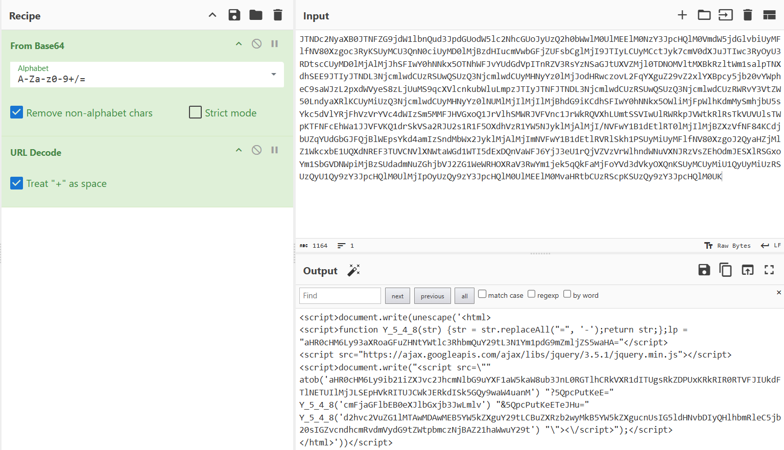
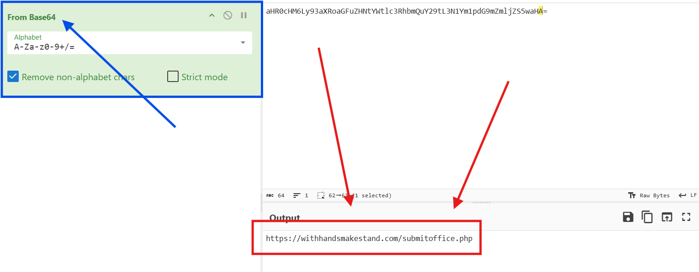

# CTF Challenge – Email Analysis 01

**File:** [email01.eml](./email01.eml)\
**Category:** Phishing / Email Analysis / Threat Detection

## Questions

1. **Sender Address**\
   What is the sender’s actual email address?\
   *Answer format:* plain email address

2. **Attachment Name**\
   What is the full filename of the attached payload?\
   *Answer format:* filename with extension

3. **Obfuscation Technique**\
   Which technique is used by the attachment to deliver or hide the malicious code?\
   *Answer format:* technique name (e.g., HTML smuggling)

4. **JavaScript Function**\
   Identify the name of the JavaScript function embedded in the attachment.\
   *Answer format:* exact function name

5. **Decoded Payload URL**\
   What is the decoded URL or domain extracted from the obfuscated payload?\
   *Answer format:* full URL or domain

6. **MIME Boundary**\
   What is the boundary string used to separate parts in the MIME message?\
   *Answer format:* boundary text without quotes

7. **Priority Indicator**\
   Which header indicates the email’s priority, and what is its value?\
   *Answer format:* header name: value

---

## Writeup and Solutions

Below are detailed steps, pointing to where in the `.eml` file or decoded content each answer is found.

### Question 1: Sender Address

- **Where to look:** The `From:` header near the top of the message.
- **Header line:**
  ```
  From: Human Resources <robert.yi@globalleadership.org>
  ```


- **Answer:**
  ```
  robert.yi@globalleadership.org
  ```

### Question 2: Attachment Name

- **Where to look:** The MIME part with `Content-Disposition: attachment; filename=...`.
- **Excerpt:**
  ```
  Content-Disposition: attachment; filename="html_smuggling_atob_high_entropy.shtml"
  ```
- **Answer:**
  ```
  html_smuggling_atob_high_entropy.shtml
  ```


### Question 3: Obfuscation Technique

- **Where to look:** The attachment payload is an HTML file containing Base64-encoded JavaScript which builds content at runtime.
- **Technique:** Embedding a script that reconstructs malicious code in the browser is known as **HTML smuggling**.
- **Answer:**
  ```
  HTML smuggling
  ```

### Question 4: JavaScript Function

- **Where to look:** Decode the Base64 blob to plain text, then URL-decode. The decoded snippet contains a function declaration.



- **Decoded snippet:**
  ```html
  <script>
    function Y_5_4_8(str) {
      str = str.replaceAll("=", '-');
      return str;
    };
  </script>
  ```
- **Answer:**
  ```
  Y_5_4_8
  ```

### Question 5: Decoded Payload URL

- **Where to look:** Immediately after the function `Y_5_4_8`, the script defines a Base64 string assigned to the variable `lp`, and also uses a separate `<script>` tag to load jQuery. The jQuery URL is a benign library include, not the malicious payload.


- **Decoding steps:**
  1. The Base64 value assigned to `lp` (`aHR0cHM6Ly93aXRoaGFuZHNtYWtlc3RhbmQuY29tL3N1Ym1pdG9mZmljZS5waHA=`) decodes to:
     ```
     https://withhandsmakestand.com/submitoffice.php
     ```

     

  2. The second `<script src="...jquery.min.js">` simply loads a public library and is not part of the payload delivery.
  3. The `atob()` call later decodes a second URL, but this is a decoy or additional tracking endpoint.
- **Reasoning:** The `lp` variable contains the actual malicious endpoint to which stolen data would be submitted. The jQuery include is standard and not considered the payload URL.
- **Answer:**
  ```
  https://withhandsmakestand.com/submitoffice.php
  ```

### Question 6: MIME Boundary MIME Boundary

- **Where to look:** The `Content-Type: multipart/mixed; boundary=` header.
- **Header line:**
  ```
  Content-Type: multipart/mixed; boundary=5c881faebd8bc180f75f9d3ea571f76c42568226239c798c9acc899a6a4c
  ```


- **Answer:**
  ```
  5c881faebd8bc180f75f9d3ea571f76c42568226239c798c9acc899a6a4c
  ```

### Question 7: Priority Indicator

- **Where to look:** Mail client priority headers near the top.
- **Headers:**
  ```
  X-Priority: 1
  Importance: 1
  X-MSmail-Priority: Highest
  ```
- **Answer:**
  ```
  X-Priority: 1
  ```

---


