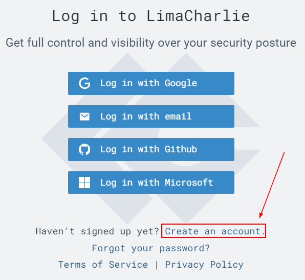
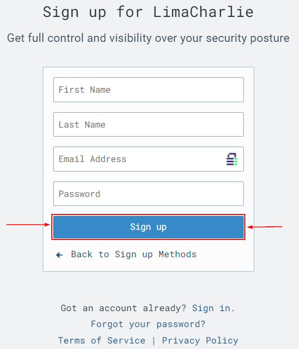
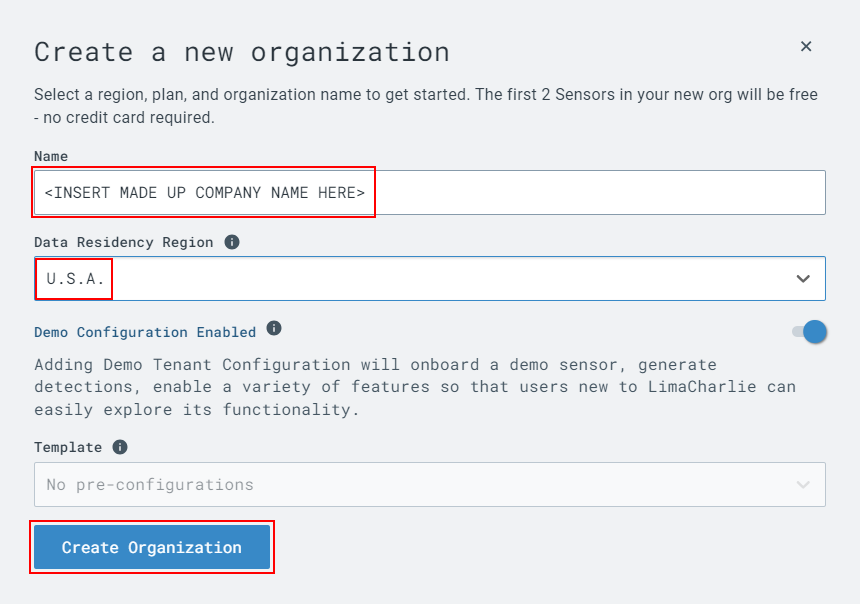
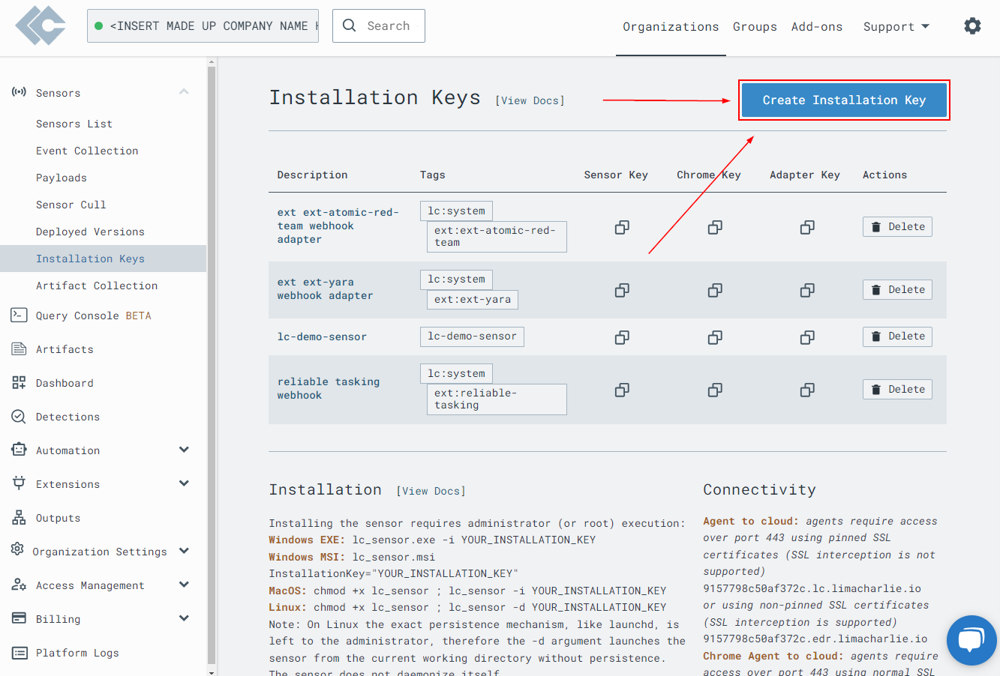
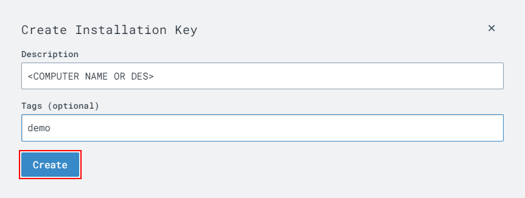
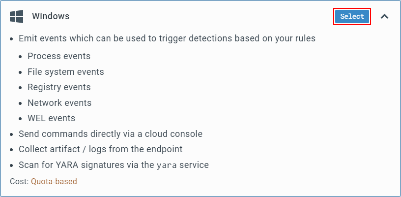
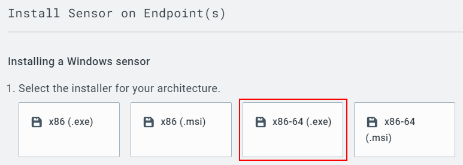
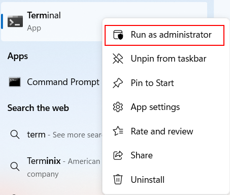

# **LimaCharlie Lab**

---

## **Part 1 of 2 – Endpoint Monitoring & Threat Detection**

In this lab we will be using **LimaCharlie** to investigate **endpoint monitoring** and **threat detection**.

### **What is LimaCharlie?**

LimaCharlie is a lightweight browser-based tool. It helps monitor systems, detect threats, and respond quickly to suspicious activity. This walkthrough uses the **Chrome** browser, but any browser may be used.

---

## **Step 1: Access LimaCharlie**

Open a browser and go to:

```
https://app.limacharlie.io/
```

Click **"Create an account"**.



---

## **Step 2: Sign Up**

Choose a sign-up method:


Select **"Sign up with email"**:



Fill out the required fields and click **"Sign Up"**.

Check your email, click the verification link, then return to your browser and refresh the page.

---

## **Step 3: Setup Company Information**

You will be asked questions about your company. Use fictional information.

Enter the following details:

- **What best describes your team/company?** → *Security Operations Center*
- **What best describes your role?** → *Security Engineer*
- **What use cases are you exploring?** → *Endpoint Detection & Response*
- **How did you hear about us?** → *Black Hills Info Sec*


Check the box to agree to the Terms of Service and Privacy Policy.

Click **"Get Started"** then **"Create Organization"**.


Fill out your fictional organization’s details.



Click **"Create Organization"**.

Wait for the organization to be created.


Select your organization to continue.

---

## **Step 4: Create a Sensor**

Under the left-hand menu, go to **Sensors → Installation Keys**.


Click **"Create Installation Key"**.



Fill in a description and tags, then click **"Create"**.



Next, go to **Sensors List**.


Click **"Add Sensor"**.


Scroll down and select the **Windows** sensor.



From the drop-down, select the installation key created earlier and click **"Select"**.


Choose the architecture: **"86-64 exe"**.



Click **"Download the selected installer"**.

Copy the command string from **Step 4**.


---

## **Step 5: Install the Sensor**

Go to your desktop, right-click **Windows Terminal**, and select **"Run as administrator"**.



Navigate to your Downloads directory:

```
cd .\Downloads
```

Begin typing the following command and use **Tab** for auto-completion:

```
.\hcp_win_x64_release_4.29.2.exe
```

Paste the copied command string and press **Enter**.

If successful, your output will look like this:


Return to your browser. You should see a confirmation message:


>[!TIP]
>
> **Note**: Your computer name will differ.

---

## **Next Steps**

- [Continue to Part 2 of the Lab](./lima_charlie_lab_part2.md)

- Source: https://github.com/strandjs/IntroLabs/blob/master/IntroClassFiles/Tools/IntroClass/limacharlie/limacharlie.md

>[!IMPORTANT]
>
> **Important**: Always destroy your lab environment after completing exercises.

---
[Back to the Section](/courseFiles/Section_02-toolsAndPlatforms/toolsAndPlatforms.md)
