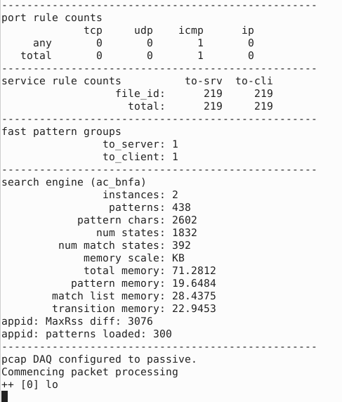
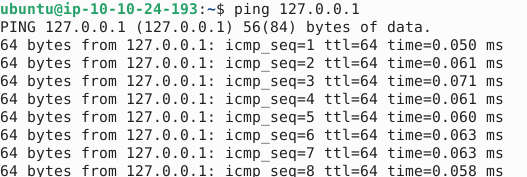
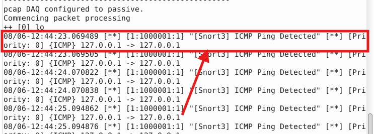

# IDS Lab — Using Snort & Suricata
 
## Lab Goals
 
Learn how to:
- Use **Snort** and **Suricata** 
- Create and test **custom detection rules**
- Simulate **attacks** (ping, Nmap, Nikto, curl, etc.)
- Monitor and analyze **alerts**
 
 
---
 
## 1. Install IDS Tools on Kali
 
### Install Snort (via apt)

>it should already be installed!
 
Verify:
 
```bash
snort -V
```
>[!IMPORTANT]
>
> Output should say **Snort++ / Snort 3.x**
 


---
 
### Install Suricata
 

>it should already be installed!

Verify:
 
```bash
suricata --build-info
```


---
 
## 2. Lab Folder Structure (Optional)
 
```bash
mkdir -p ~/labs/ids_lab/{rules,logs,pcaps}
```
 
---
 
## 3. Snort Lab
 
### A. Create a Snort Rule
 
```bash
nano ~/labs/ids_lab/rules/local.rules
```
 
Paste:
 
```snort
alert icmp any any -> any any (msg:"[Snort3] ICMP Ping Detected"; sid:1000001; rev:1;)
```
 


---
 
###  B. Run Snort 
 
```bash
sudo snort -c /home/ubuntu/labs/ids_lab/snort3-3.8.1.0/lua/snort.lua -R ~/labs/ids_lab/rules/local.rules -i lo -A alert_fast 
```
 
- `-c`: config file
- `-R`: rule file
- `-i lo`: loopback interface
- `-A alert_fast`: fast alert output
 


---
 
### C. Simulate Traffic
 
Open a new terminal:
 
```bash
ping 127.0.0.1
```
 


 You should see something similar to this:
 
```
[Snort3] ICMP Ping Detected
```
 


---
 
### More Snort Rules
 
In `local.rules`, add:
 
```snort
alert tcp any any -> any any (flags:S; msg:"[Snort3] SYN Scan Detected"; sid:1000002; rev:1;)
```
 


Test:
 
```bash
sudo nmap -sS 127.0.0.1
```
 


---
 
## 4. Suricata Lab
 
### A. Add Custom Rules
 
```bash
sudo nano /var/lib/suricata/rules/suricata.rules
```
 
Paste:
 
```suricata
alert icmp any any -> any any (msg:"[Suricata] ICMP Ping Detected"; itype:8; sid:2000001;)
```
 
Ensure `/etc/suricata/suricata.yaml` includes:
 
```yaml
default-rule-path: /var/lib/suricata/rules
 
rule-files:
  - suricata.rules
```
 
---
 
### B. Run Suricata
 
```bash
sudo suricata -c /etc/suricata/suricata.yaml -i lo
```


Then(in another terminal):
 
```bash
ping 127.0.0.1
```
 
Check alerts(in a 3rd terminal):
 
```bash
sudo tail -f /var/log/suricata/fast.log
```


 
---
 
## 5.Skills You're Practicing
 
| Skill              | Purpose                                           |
|-------------------|---------------------------------------------------|
| IDS Configuration | Setup and tuning for detection effectiveness      |
| Rule Writing       | Customize detection, reduce false positives       |
| Alert Triage       | Investigate logs quickly and efficiently          |
| Attack Simulation  | Understand adversary behavior                     |
| Incident Reporting | Communicate findings clearly in report format     |
 
---
 
##  6. Mini-Incident Report Example
 
| Field           | Example                       |
|----------------|-------------------------------|
| **Time**        | 2025-07-24 14:32              |
| **Tool**        | Suricata                      |
| **Alert**       | ICMP Ping Detected            |
| **Source IP**   | 127.0.0.1                     |
| **Dest IP**     | 127.0.0.1                     |
| **Rule SID**    | 2000001                       |
 
 
---
 
## 7. Useful resource
 
- [snorpy](https://snorpy.cyb3rs3c.net) -A Web Based Snort Rule Creator


---
[Back to the section](/courseFiles/Section_05-networkingAndTelemetry/networkingAndTelemetry.md)
