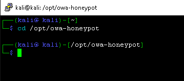

# Deploying a JS Cloned Website CanaryToken


## Step 1: Create the CanaryToken

Go to:

[https://www.canarytokens.org/nest/](https://www.canarytokens.org/nest/)

Choose **JS Cloned Website**  


Enter a domain of your choosing, and the email and notification method you want to receive.  


---

## Step 2: Set Up the Honeypot on MetaCTF Windows + Kali VM

Log into your Kali instance.  


Become root:
```bash
sudo su -
```

Navigate to the honeypot directory:
```bash
cd /opt/owa-honeypot
```


> **Note:** This directory contains the core components of the OWA honeypot.  
> `owa_pot.py` is the main Flask app that mimics an OWA login page and logs credentials.  
> `dumpass.log` stores login attempts (username, password, IP, and user-agent).  
> `requirements.txt` lists Flask as the only dependency.  
> `templates/` holds the fake login and error HTML pages.  
> `env/` is a virtual environment folder.  
> `instance/` is used by Flask for local configs.  
> `README.md` provides setup and usage details.

## Step 3: Inject the CanaryToken JavaScript

Change into the `templates` directory:
```bash
cd templates
```


Edit the `outlook_web.html` template using `nano`:
```bash
nano outlook_web.html
```

After the `<head>` tag, add a line with:
```html
<SCRIPT>
```

Then go back to your CanaryToken page and copy the JavaScript snippet.  


>[!IMPORTANT]
>
> ⚠️ **Do NOT close the CanaryToken page after copying the JavaScript!**

Paste the script into the `nano` editor.  


Then add the closing `</SCRIPT>` tag.  


Save the file:

- Press `Ctrl + O`
- Hit `Enter`
- Exit with `Ctrl + X`

Navigate back to the previous directory:
```bash
cd ..
```


Start the honeypot server:  


---

## Step 4: Monitor Token Activity

Return to the CanaryToken page. Scroll down and click on **Manage Canarytoken**. 


You should see that the token has **not** yet been triggered. 


---

## Step 5: Trigger the Honeypot

Any good hacker will try and test their site.

Back on the Windows system, open a browser and visit the honeypot site.  


Return to your CanaryToken management page and refresh it.

Your token should now be triggered!
 
  


---
[Back to the Section](/courseFiles/Section_08-deceptionSystems/deceptionSystems.md)
